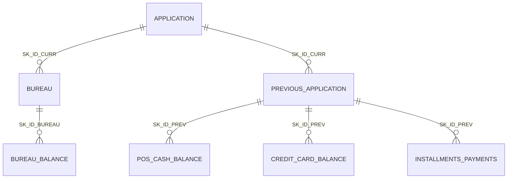

# Schéma des jointures et intégrité référentielle

Généré par `src/data/profile_joins.py` — toutes les valeurs sont **mesurées**
sur l'intégralité des fichiers, sans échantillonnage.

## Modèle relationnel

Trois systèmes sources, deux arborescences distinctes qui convergent sur
`SK_ID_CURR`, l'identifiant du dossier à scorer.

## Granularité (le grain de chaque table)

Confondre le grain d'une table est la première cause de duplication de
lignes lors d'une jointure. Chaque table est agrégée **jusqu'au grain
`SK_ID_CURR`** avant toute jointure avec la table de demandes.

| Table | Une ligne représente | Grain |
|---|---|---|
| `application_train` / `_test` | une demande de crédit à scorer | `SK_ID_CURR` |
| `bureau` | un crédit détenu ailleurs, déclaré au bureau externe | `SK_ID_BUREAU` |
| `bureau_balance` | l'état mensuel d'un crédit externe | `SK_ID_BUREAU` × mois |
| `previous_application` | une demande antérieure chez CrediScore | `SK_ID_PREV` |
| `POS_CASH_balance` | l'état mensuel d'un crédit POS/cash antérieur | `SK_ID_PREV` × mois |
| `credit_card_balance` | l'état mensuel d'une carte de crédit antérieure | `SK_ID_PREV` × mois |
| `installments_payments` | une échéance due et son paiement effectif | `SK_ID_PREV` × échéance |

## Intégrité et cardinalités mesurées

| Relation | Clé | Parents | Avec ≥ 1 enfant | Couverture | Enfants (méd. / moy. / max) | Hors table | **Hors périmètre** |
|---|---|---|---|---|---|---|---|
| `application_train` → `bureau` | SK_ID_CURR | 307 511 | 263 491 | 85.7 % | 4 / 5.6 / 116 | 42 320 | **0** |
| `bureau` → `bureau_balance` | SK_ID_BUREAU | 1 716 428 | 774 354 | 45.1 % | 25 / 31.2 / 97 | 43 041 | **43 041** |
| `application_train` → `previous_application` | SK_ID_CURR | 307 511 | 291 057 | 94.6 % | 4 / 4.9 / 73 | 47 800 | **0** |
| `previous_application` → `POS_CASH_balance` | SK_ID_PREV | 1 670 214 | 898 903 | 53.8 % | 10 / 10.7 / 96 | 37 422 | **37 422** |
| `previous_application` → `credit_card_balance` | SK_ID_PREV | 1 670 214 | 92 935 | 5.6 % | 18 / 29.7 / 96 | 11 372 | **11 372** |
| `previous_application` → `installments_payments` | SK_ID_PREV | 1 670 214 | 958 905 | 57.4 % | 10 / 12.9 / 293 | 38 847 | **38 847** |

### Lecture

**Deux natures d'orphelins, à ne surtout pas confondre.** La colonne
*Hors table* compte les clés enfant absentes de la seule table parent
analysée ; la colonne *Hors périmètre* compte celles absentes de **tout**
le périmètre (`application_train` + `application_test`).

Les ~42 000 et ~47 800 clés « hors table » des deux premières relations
vers `application_train` ne sont donc **pas** un défaut : ce sont les
dossiers de `application_test`, qui possèdent bien un historique. La
colonne *hors périmètre* le confirme à zéro.

En revanche, les orphelins des relations `bureau → bureau_balance` et
`previous_application → *` sont **réels** : ces lignes filles référencent
un parent qui n'existe dans aucun fichier. Elles seront écartées à
l'ingestion et le volume écarté journalisé — un contrôle qualité bloquant
ne doit jamais rejeter en silence.

- Chevauchement `application_train` / `application_test` : **0 identifiant(s) commun(s)** — les deux populations
  sont disjointes, aucune fuite par recouvrement d'identifiants.

La **couverture** est l'information décisive pour le feature engineering :
elle fixe mécaniquement le taux de valeurs manquantes des variables agrégées.
Un dossier sans historique bureau n'aura pas de `BUREAU_*` — cette absence
est une information en soi (primo-emprunteur), à ne pas imputer aveuglément.

## Couverture au grain dossier

Le tableau précédent mesure la couverture d'une table par son parent
**direct**. Celui-ci mesure ce qui compte vraiment pour le feature
engineering : la part des dossiers de `application_train` qui possèdent au
moins une ligne dans chaque source, en suivant tout le chemin de jointure.
C'est le **taux de valeurs manquantes plancher** de chaque famille de
variables agrégées.

| Source | Préfixe des variables | Dossiers couverts | Couverture | Manquantes |
|---|---|---|---|---|
| `bureau` | `BUREAU_*` | 263 491 | 85.7 % | **14.3 %** |
| `bureau_balance` | `BB_*` | 92 231 | 30.0 % | **70.0 %** |
| `previous_application` | `PREV_*` | 291 057 | 94.6 % | **5.4 %** |
| `POS_CASH_balance` | `POS_*` | 286 967 | 93.3 % | **6.7 %** |
| `credit_card_balance` | `CC_*` | 77 934 | 25.3 % | **74.7 %** |
| `installments_payments` | `INSTAL_*` | 289 406 | 94.1 % | **5.9 %** |

## Colonnes temporelles

| Fichier | Colonne | Type | Min | Max | Unité |
|---|---|---|---|---|---|
| `application_train.csv` | `DAYS_BIRTH` | int64 | -25 229 | -7 489 | jours |
| `application_train.csv` | `DAYS_EMPLOYED` | int64 | -17 912 | 365 243 | jours |
| `application_train.csv` | `DAYS_REGISTRATION` | float64 | -24 672 | 0 | jours |
| `application_train.csv` | `DAYS_ID_PUBLISH` | int64 | -7 197 | 0 | jours |
| `application_train.csv` | `DAYS_LAST_PHONE_CHANGE` | float64 | -4 292 | 0 | jours |
| `bureau.csv` | `DAYS_CREDIT` | int64 | -2 922 | 0 | jours |
| `bureau.csv` | `DAYS_CREDIT_ENDDATE` | float64 | -42 060 | 31 199 | jours |
| `bureau.csv` | `DAYS_ENDDATE_FACT` | float64 | -42 023 | 0 | jours |
| `bureau_balance.csv` | `MONTHS_BALANCE` | int64 | -96 | 0 | mois |
| `previous_application.csv` | `DAYS_DECISION` | int64 | -2 922 | -1 | jours |
| `POS_CASH_balance.csv` | `MONTHS_BALANCE` | int64 | -96 | -1 | mois |
| `credit_card_balance.csv` | `MONTHS_BALANCE` | int64 | -96 | -1 | mois |
| `installments_payments.csv` | `DAYS_INSTALMENT` | float64 | -2 922 | -1 | jours |
| `installments_payments.csv` | `DAYS_ENTRY_PAYMENT` | float64 | -4 921 | -1 | jours |

### Valeurs sentinelles détectées

| Fichier | Colonne | Valeur | Occurrences | Part |
|---|---|---|---|---|
| `application_train.csv` | `DAYS_EMPLOYED` | 365 243 | 55 374 | 18.0 % |

`DAYS_EMPLOYED = 365243` correspond à une ancienneté d'emploi de
**+1000 ans dans le futur** : ce n'est pas une mesure mais un code,
signifiant « sans emploi / retraité ». Laissée telle quelle, cette
valeur écrase toute statistique d'ancienneté et fausse les seuils de
coupure des arbres. Traitement retenu : remplacement par `NaN` **et**
création d'un indicateur binaire `DAYS_EMPLOYED_ANORMAL`, qui conserve
l'information au lieu de la détruire (voir `docs/plan_features.md`).

### Conséquence sur la stratégie de découpage

**Aucune colonne texte convertible en date absolue** dans les 8 sources.

Toutes les colonnes temporelles sont des **décalages relatifs négatifs**,
comptés depuis la date de la demande courante — laquelle n'est jamais
fournie. Le jeu est donc **anonymisé dans le temps** : deux dossiers dont
`DAYS_BIRTH = -12000` n'ont pas été déposés le même jour, et rien ne permet
de les ordonner l'un par rapport à l'autre.

Il est par conséquent **impossible de construire un découpage temporel**
(*out-of-time*) sur ces données. Voir `docs/strategie_decoupage.md` pour la
stratégie retenue en conséquence.
